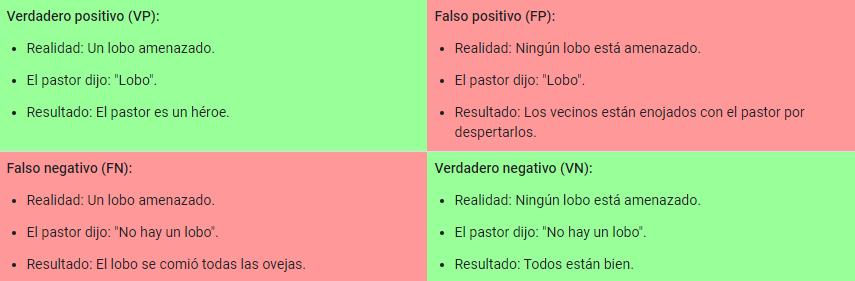

<p align="center">
  
</p>

# CURSO DE APRENDIZAJE AUTOMATICO HECHO POR GOOGLE

## Tabla de contenido:
1. [Introducción](#introduction) [👻](https://developers.google.com/machine-learning/crash-course/ml-intro?hl=es-419)
2. [Generalizacion](#generalizacion) [👻](https://developers.google.com/machine-learning/crash-course/generalization/video-lecture?hl=es-419)
3. [Representacion](#representacion) [👻](https://developers.google.com/machine-learning/crash-course/representation/video-lecture?hl=es-419)
4. [Combinacion de Atributos](#combinacion)
5. [Vectores](#vectores)
6. [Regresion logistica](#regresion) [👻](https://developers.google.com/machine-learning/crash-course/logistic-regression/video-lecture?hl=es-419)
7. [Clasificacion](#clasificaion) [👻](https://developers.google.com/machine-learning/crash-course/classification/video-lecture?hl=es-419)
8. [Regularizacion](#regularizacion) [👻](https://developers.google.com/machine-learning/crash-course/regularization-for-sparsity/video-lecture?hl=es-419)
9. [Redes neuronales](#redesneuronales) [👻](https://developers.google.com/machine-learning/crash-course/introduction-to-neural-networks/video-lecture?hl=es-419)
10. [](#) [👻]()
11. [](#) [👻]()
12. [](#) [👻]()

## Introduccion: <p id="introduction">
Este es un curso hecho por google, donde nos ofrece una amplia informacion para informarnos sobre `Tensorflow` su biblioteca de aprendizaje automatico
Igualemente utilizaremos otras tecnologias, como numPy y Pandas

[Curso que veremos](https://developers.google.com/machine-learning/crash-course/ml-intro?hl=es-419)
[Cursos Basicos](https://developers.google.com/machine-learning?hl=es-419)

# TENSORFLOW
A medida que avances en el Curso intensivo de aprendizaje automático, podrás poner en práctica los conceptos del aprendizaje automático mediante la codificación de modelos en tf.keras. Usarás Colab como entorno de programación. Colab es la versión de Google de Notebook de Jupyter. Al igual que el notebook de Jupyter, Colab proporciona un entorno interactivo de programación de Python que combina texto, código, gráficos y resultados del programa.

## NumPy y Pandas
El uso de tf.keras requiere, al menos, un poco de comprensión de las siguientes dos bibliotecas de código abierto de Python:

NumPy, que simplifica la representación de arrays y la realización de operaciones de álgebra lineal. [Numpy](https://numpy.org/)
<br>

pandas, que proporciona una manera fácil de representar conjuntos de datos en la memoria. [Pandas](https://pandas.pydata.org/)

Si no estás familiarizado con NumPy o Pandas, comienza con los siguientes dos ejercicios de Colab:

Ejercicio de Colab de NumPy UltraQuick Tutorial, que brinda toda la información de NumPy que necesitas para este curso. (NUMPY TUTORIAL)
Ejercicio de Colab sobre el instructivo rápido de Pandas, que brinda toda la información que necesitas sobre este curso. (PANDAS TUTORIAL)

<br>

## Generalizacion <p id="generalizacion">
Guillermo de Ockham, un fraile y filósofo del siglo XIV, amaba la simplicidad. Creía que los científicos deberían preferir lo más simple fórmulas o teorías sobre otras más complejas. Para poner la navaja de Ockham en la máquina Términos de aprendizaje:
`Cuanto menos complejo sea un modelo de ML, más probable es que se obtenga un buen resultado empírico no se debe solo a las peculiaridades de la muestra.`

<br>

Un modelo de aprendizaje automático tiene como objetivo hacer buenas predicciones sobre datos nunca antes vistos. Pero si está construyendo un modelo a partir de su conjunto de datos, ¿cómo obtendría los datos nunca antes vistos? Pozo Una forma es dividir el conjunto de datos en dos subconjuntos:

<br>

Conjunto de entrenamiento: un subconjunto para entrenar un modelo.
Conjunto de pruebas: un subconjunto para probar el modelo.

<br>

Un buen rendimiento en el equipo de prueba es un indicador útil de un buen rendimiento sobre los nuevos datos en general, asumiendo que:

<br>

El equipo de prueba es lo suficientemente grande.
No se hace trampa utilizando el mismo conjunto de pruebas una y otra vez.

El set de prueba es el que menos datos debe contener, ya que el entrenamiento es la prioridad

Conjunto de entrenamiento: Un subconjunto para entrenar un modelo.
Conjunto de prueba: Un subconjunto para probar el modelo entrenado.
Puedes imaginarte dividir el único conjunto de datos de la siguiente manera:

<br>


<br>

Asegúrate de que tu conjunto de prueba cumpla con las siguientes dos condiciones:

Sea lo suficientemente grande como para generar resultados significativos desde el punto de vista estadístico.
Que sea representativo del conjunto de datos en su conjunto. En otras palabras, no elijas un conjunto de prueba con características diferentes a las del conjunto de entrenamiento.

Nunca uses datos de prueba para el entrenamiento. Si ves resultados sorprendentemente buenos en tus métricas de evaluación, puede ser una señal de que estás entrenando accidentalmente en el conjunto de prueba. Por ejemplo, una precisión alta puede indicar que los datos de prueba se filtraron en el conjunto de entrenamiento.

<br>

Para saber que tantos datos necesita nuestro modelo  para trabajar correctamente, podemos crear conjuntos de entrenamiento y prueba

<br>

Cuando el conjunto de entrenamiento es mas grande, la capacidad del modelo de predecir crece significativamente...
A mayor conjunto de prueba, mayor sera la confianza de los resultados

<br>

Es bueno tener un conjunto de datos MUY GRANDE
aproximadamente el 15%

<br>

***Ejercicio de Google***

<br>

[Practica!](https://developers.google.com/machine-learning/crash-course/training-and-test-sets/playground-exercise?hl=es-419)
Con este ejercicio podremos comprender un poco mas sobre los datos de entrenamiento...

<br>

***Flujo de trabajo***

<br>


En la figura, "Ajustar el modelo" significa ajustar cualquier elemento del modelo que puedas imaginar, desde cambiar la tasa de aprendizaje hasta agregar o quitar atributos, o diseñar un modelo completamente nuevo desde cero. Al final de este flujo de trabajo, debes elegir el modelo que mejor se desempeñe con respecto al conjunto de prueba.

Dividir el conjunto de datos en dos conjuntos es una buena idea, pero no una panacea. Para reducir en gran medida las posibilidades de sobreajuste, puedes particionar el conjunto de datos en los tres subconjuntos que se muestran en la siguiente figura:

<br>


<br>

Usa el conjunto de validación para evaluar los resultados del conjunto de entrenamiento. A continuación, usa el conjunto de prueba para verificar la evaluación después de que el modelo haya "pasado" el conjunto de validación. En la siguiente figura, se muestra este nuevo flujo de trabajo:

<br>


<br>

***En este flujo de trabajo mejorado, sucede lo siguiente:***

<br>

Elige el modelo que mejor se desempeñe con el conjunto de validación.
Vuelve a verificar el modelo con el conjunto de prueba.
Este flujo de trabajo es más eficaz porque crea menos exposiciones al conjunto de prueba.

<br>

***Ejercicio: (ir al archivo *VALIDACION Y SETS DE DATOS* y completarlo)***

<br>

***Ingeniería de atributos***

<br>

Cómo asignar valores numéricos
Los datos de número entero y de punto flotante no necesitan una codificación especial porque se pueden multiplicar por un peso numérico. Como se sugiere en la Figura 2, convertir el valor entero sin procesar 6 en el valor de atributo 6.0 es sencillo:

<br>


<br>

Asignación de valores categóricos
Los atributos categóricos tienen un conjunto discreto de valores posibles. Por ejemplo, podría haber una función llamada street_name con opciones que incluyan las siguientes:


{'Charleston Road', 'North Shoreline Boulevard', 'Shorebird Way', 'Rengstorff Avenue'}
Dado que los modelos no pueden multiplicar strings por los pesos aprendidos, usamos la ingeniería de atributos para convertir strings en valores numéricos.

Para ello, definimos una asignación de los valores de los atributos, a los que nos referiremos como vocabulario de valores posibles, a números enteros. Dado que no todas las calles del mundo aparecerán en nuestro conjunto de datos, podemos agrupar todas las demás calles en una categoría general llamada "otras", que se conoce como un bucket OOV (fuera del vocabulario).

Mediante este enfoque, podemos asignar nombres de calles a números de la siguiente manera:

asignar Charleston Road a 0
asignar North Shoreline Boulevard a 1
asignar Shorebird Way a 2
asignar Rengstorff Avenue a 3
asignar todo lo demás (OOV) a 4
Sin embargo, si incorporamos estos números índice directamente en nuestro modelo, impondrá algunas restricciones que podrían ser problemáticas:

Aprenderemos un peso único que se aplique a todas las calles. Por ejemplo, si aprendemos un peso de 6 para street_name, lo multiplicaremos por 0 para Charleston Road, por 1 para North Shoreline Boulevard, por 2 para Shorebird Way y así sucesivamente. Considera un modelo que prediga el precio de las casas usando street_name como atributo. Es poco probable que haya un ajuste lineal del precio basado en el nombre de la calle. Además, esto supondrá que ordenaste las calles según el precio promedio de las casas. Nuestro modelo necesita la flexibilidad de aprender los diferentes pesos para cada calle, que se agregarán al precio estimado con los otros atributos.

No estamos contemplando los casos en los que street_name puede tener varios valores. Por ejemplo, muchas casas se encuentran en la esquina de dos calles y no hay forma de codificar esa información en el valor street_name si este contiene un solo índice.

Para quitar ambas restricciones, podemos crear un vector binario para cada atributo categórico de nuestro modelo que represente valores de la siguiente manera:

En el caso de los valores que se aplican al ejemplo, establece los elementos correspondientes al vector en 1.
Establecer todos los demás elementos en 0.
La longitud de este vector es igual a la cantidad de elementos en el vocabulario. Esta representación se denomina codificación one-hot cuando un único valor es 1 y codificación multi-hot cuando varios valores son 1.

La figura 3 ilustra una codificación one-hot de una calle determinada: Shorebird Way. El elemento del vector binario de Shorebird Way tiene un valor de 1, mientras que los elementos de todas las demás calles tienen un valor de 0.

<br>


<br>

Este enfoque crea de manera efectiva una variable booleana para cada valor de atributo (p.ej., nombre de la calle). En este caso, si una casa se encuentra en Shorebird Way, el valor binario es solo 1 para Shorebird Way. Por lo tanto, el modelo utiliza solo el peso para la calle Shorebird Way.

Del mismo modo, si una casa se encuentra en la esquina de dos calles, entonces dos valores binarios se establecen en 1, y el modelo usa ambos pesos respectivos.

# Representación: Limpieza de datos <p id="representacion">

Los manzanos producen una mezcla de frutas excelentes y gusanos. Sin embargo, las manzanas que se muestran en los supermercados refinados son frutas 100% perfectas. Entre el huerto y el supermercado, alguien pasa mucho tiempo quitando las manzanas en mal estado o lanzando un poco de cera sobre las que se pueden recuperar. Como ingeniero de AA, dedicarás una gran cantidad de tu tiempo a desechar ejemplos malos y limpiar los que se pueden recuperar. Incluso unas pocas "manzanas en mal estado" pueden arruinar un gran conjunto de datos.

Ajusta valores de atributos
Escalamiento significa convertir los valores de atributos de punto flotante de su rango natural (por ejemplo, 100 a 900) al rango estándar (por ejemplo, 0 a 1 o -1 a +1). Si un conjunto de atributos consiste en una sola función, el escalamiento proporciona poco o ningún beneficio práctico. Sin embargo, si un conjunto de atributos consta de varios atributos, el escalamiento de atributos proporciona los siguientes beneficios:

Ayuda a que el descenso de gradientes converja más rápidamente.
Ayuda a evitar la "trampa de NaN", en la que un número del modelo se convierte en un NaN (p.ej., cuando un valor excede el límite de precisión de punto flotante durante el entrenamiento) y, debido a operaciones matemáticas, el resto de los números del modelo finalmente se convierte en NaN.
Permite que el modelo aprenda las ponderaciones correspondientes para cada atributo. Sin el ajuste de atributos, el modelo les prestará demasiada atención a los atributos que tienen un rango más amplio.
No es necesario que asignes el mismo ajuste de escala a cada atributo de punto flotante. No sucederá nada terrible si el Atributo A se escala de -1 a +1, mientras que el Atributo B se ajusta de -3 a +3. Sin embargo, tu modelo reaccionará mal si el Atributo B se escala de 5,000 a 100,000.

***Manejo de valores atípicos extremos***

<br>

El siguiente gráfico representa un atributo llamado roomsPerPerson del conjunto de datos Viviendas de California. El valor de roomsPerPerson se dividió dividiendo la cantidad total de habitaciones en un área por la población en esa área. El gráfico muestra que la gran mayoría de áreas en California tiene una o dos habitaciones por persona. Pero veamos el eje X.

<br>


<br>

entonces:

<br>


<br>

El recorte del valor del atributo en 4.0 no significa que ignoremos todos los valores superiores a 4.0. En cambio, significa que todos los valores que eran superiores a 4.0 ahora se convierten en 4.0. Esto explica la elevación extraña en 4.0. A pesar de esa elevación, el conjunto de atributos ajustado ahora es más útil que los datos originales.

<br>

En el conjunto de datos, latitude es un valor de punto flotante. Sin embargo, no tiene sentido representar latitude como un atributo de punto flotante en nuestro modelo. Eso se debe a que no existe una relación lineal entre la latitud y los valores de las viviendas. Por ejemplo, las casas en la latitud 35 no son 
 más costosas (o menos costosas) que las casas en la latitud 34. Sin embargo, las latitudes individuales probablemente son un muy buen predictor de los valores de casas.

Para que la latitud sea un predictor útil, debemos dividir las latitudes en discretizaciones, como se sugiere en la siguiente figura:

<br>


<br>

En lugar de tener un atributo de punto flotante, ahora tenemos 11 atributos booleanos distintos (LatitudeBin1, LatitudeBin2, ..., LatitudeBin11). Tener 11 atributos independientes es algo poco elegante, por lo que hay que unirlos en un solo vector de 11 elementos. Esto nos permitirá representar la latitud 37.4 de la siguiente manera:

`[0, 0, 0, 0, 0, 1, 0, 0, 0, 0, 0]`


Gracias a la discretización, nuestro modelo ahora puede aprender pesos completamente diferentes para cada latitud.


# COMBINACIONES DE ATRIBUTOS <p id="combinacion">
***Codificación de no linealidad***

<br>


<br>

¿Es un problema lineal?

¿Puedes dibujar una línea que separe los árboles enfermos de los sanos? Claro. Este es un problema lineal. La línea no será perfecta. Uno o dos árboles enfermos pueden estar del lado "sano", pero la línea será un buen predictor.

Ahora, observe la siguiente figura:


¿Es un problema lineal?

¿Puedes trazar una sola línea recta que separe los árboles enfermos de los sanos? No, no puedes. Este es un problema no lineal. Cualquier línea que dibujes será un predictor deficiente del estado de los árboles.


Para resolver el problema no lineal que se muestra en la Figura 2, crea una combinación de atributos. Una combinación de atributos es un atributo sintético que codifica la no linealidad en el espacio de los atributos al multiplicar dos o más atributos de entrada. (El término combinación proviene de productos cruzados). Creemos una combinación de atributos llamada x3 mediante la combinacion `x1` y `x2`
`x3 = x1*x2`


Tratamos esta combinación de atributos x3 como cualquier otro atributo. La fórmula lineal pasa a ser la siguiente:

`y=b+w1*x1+w2*x2+w3*x3`

Un algoritmo lineal puede aprender un peso para `w3`
del mismo modo que para  `w1` y `w2` 
En otras palabras, aunque `w3` codifica información no lineal, no necesitas cambiar la forma en la que se entrena el modelo lineal para determinar el valor de `w3`

Tipos de combinaciones de atributos
Es posible crear muchos tipos de combinaciones de atributos diferentes. Por ejemplo:

[A X B]: Una combinación de atributos formada al multiplicar los valores de dos atributos.
[A x B x C x D x E]: Una combinación de atributos formada al multiplicar los valores de cinco atributos.
[A x A]: Una combinación de atributos formada al elevar al cuadrado un solo atributo.
Gracias al descenso de gradientes estocástico, los modelos lineales se pueden entrenar de manera eficiente. En consecuencia, la complementación de los modelos lineales ajustados con combinaciones de atributos ha sido tradicionalmente una forma eficiente de entrenar conjuntos de datos de escala masiva.


# Vectores de una sola combinacion <p id="vectores">

Hasta ahora, nos hemos enfocado en la combinación de dos atributos de punto flotante individuales. En la práctica, los modelos de aprendizaje automático rara vez abarcan atributos continuos. Sin embargo, los modelos de aprendizaje automático suelen cruzar vectores de atributos one-hot. Piensa en combinaciones de atributos de vectores de un solo 1 como conjunciones lógicas. Por ejemplo, supongamos que tenemos dos atributos: país e idioma. Una codificación one-hot de cada una genera vectores con atributos binarios que pueden interpretarse como country=USA, country=France o language=English, language=Spanish. Luego, si realizas una combinación de atributos de estas codificaciones de un solo 1, obtienes atributos binarios que pueden interpretarse como conjunciones lógicas, como las siguientes:


  country:usa AND language:spanish
Como otro ejemplo, supongamos que discretizas latitud y longitud, lo que produce vectores de atributos de un solo 1 con cinco elementos. Por ejemplo, una latitud y longitud determinadas se pueden representar de la siguiente manera:


  binned_latitude = [0, 0, 0, 1, 0]
  binned_longitude = [0, 1, 0, 0, 0]
Supongamos que creas una combinación de atributos de estos dos vectores de atributos:


  binned_latitude X binned_longitude
Esta combinación de atributos es un vector de un solo 1 con 25 elementos (24 ceros y 1 uno). El único 1 en la combinación identifica una conjunción en particular de latitud y longitud. El modelo puede aprender asociaciones particulares sobre esa conjunción.

Supongamos que discretizamos latitud y longitud de manera mucho más amplia, de la siguiente manera:


binned_latitude(lat) = [
  0  < lat <= 10
  10 < lat <= 20
  20 < lat <= 30
]

binned_longitude(lon) = [
  0  < lon <= 15
  15 < lon <= 30
]
La creación de una combinación de atributos de esos discretizaciones groseras genera un atributo sintético con los siguientes significados:


binned_latitude_X_longitude(lat, lon) = [
  0  < lat <= 10 AND 0  < lon <= 15
  0  < lat <= 10 AND 15 < lon <= 30
  10 < lat <= 20 AND 0  < lon <= 15
  10 < lat <= 20 AND 15 < lon <= 30
  20 < lat <= 30 AND 0  < lon <= 15
  20 < lat <= 30 AND 15 < lon <= 30
]
Ahora supongamos que nuestro modelo necesita predecir qué tan satisfechos estarán los dueños de perros con los perros en función de dos atributos:

Tipo de comportamiento (ladrido, llanto, acurrucación, etc.)
Hora del día
Si compilamos una combinación de atributos a partir de estos dos atributos:


  [behavior type X time of day]
obtendremos una capacidad de predicción mucho mayor que cualquiera de las funciones. Por ejemplo, si un perro llora (de felicidad) a las 5:00 p.m. cuando el dueño regresa del trabajo, probablemente será un excelente predictor positivo de la satisfacción del propietario. Llorar (tal vez con tristeza) a las 3:00 a.m. cuando el propietario estaba durmiendo profundamente probablemente sea un fuerte predictor negativo de la satisfacción del propietario.

Los alumnos lineales se ajustan bien a los datos masivos. Usar combinaciones de atributos en conjuntos de datos masivos es una estrategia eficiente para aprender modelos muy complejos. Las redes neuronales proporcionan otra estrategia
[Practica!](https://developers.google.com/machine-learning/crash-course/feature-crosses/playground-exercises?hl=es-419)

<br>

***Combinaciones de atributos: Ejercicio de programación***

<br>

Haremos un ejuercico muy util, ve al archivo: `rEPRESENTATION_WITH_A_FEATURE_CROSS.ipynb`
[link](https://developers.google.com/machine-learning/crash-course/feature-crosses/programming-exercise?hl=es-419)

<br>

***Combinaciones de atributos: Comprueba tu comprensión***

<br>

[Comprueba tu comprensión](https://developers.google.com/machine-learning/crash-course/feature-crosses/check-your-understanding?hl=es-419)

# Regresión logística <p id="regresion">
En lugar de predecir exactamente 0 o 1, la regresión logística genera una probabilidad, un valor entre 0 y 1, exclusivo. Por ejemplo, considera un modelo de regresión logística para la detección de spam. Si el modelo infiere un valor de 0.932 en un mensaje de correo electrónico en particular, implica una probabilidad del 93.2% de que el mensaje sea spam. Más precisamente, significa que, en el límite de ejemplos de entrenamiento infinitos, el conjunto de ejemplos para los que el modelo predice 0.932 será realmente spam el 93.2% de las veces, y el 6.8% restante no lo será.

***Regresión logística: calcular una probabilidad ***
Muchos problemas requieren una estimación de probabilidad como resultado. La regresión logística es un mecanismo extremadamente eficiente para calcular las probabilidades. En términos prácticos, puedes usar la probabilidad que se muestra de cualquiera de las siguientes dos maneras:

"Tal como está"
Se convirtió en una categoría binaria.
Consideremos cómo podemos usar la probabilidad “tal como está”. Supongamos que creamos un modelo de regresión logística para predecir la probabilidad de que un perro ladre durante la noche. A esa probabilidad la llamaremos:
`p(ladridos/noche)`
Si el modelo de regresión logística predice `p(ladridos/noche) =0.05`, el propietario de un perro deberá despertarse durante aproximadamente un año aproximadamente 18 veces:

`numero_noches = p(ladridos/noche) * noches`
<br>

`18 = 0.05 *365`

En muchos casos, asignarás el resultado de la regresión logística a la solución a un problema de clasificación binaria, en el que el objetivo es predecir correctamente una de dos etiquetas posibles (p.ej., "spam" o &no es spam?) Un módulo posterior se enfoca en eso.

Es posible que te preguntes cómo un modelo de regresión logística puede garantizar un resultado que siempre se encuentre entre 0 y 1. A medida que sucede, una función sigmoidea, definida de la siguiente manera, produce resultados que tienen esas mismas características:

`y= 1/1+e^(-z)`

La función sigmoidea genera la siguiente representación:


Si `z` representa el resultado de la capa lineal de un modelo entrenado con regresión logística, producirá un valor (una probabilidad) entre 0 y 1. En términos matemáticos:


# Clasificacion <p id="clasificaion">

<br>

***Clasificación: Umbral ***

<br>

La regresión logística muestra una probabilidad. Puedes usar la probabilidad de que se muestre “tal como está” (por ejemplo, la probabilidad de que el usuario haga clic en este anuncio es 0.00023) o la convierte en un valor binario (por ejemplo, este correo electrónico es spam).

Un modelo de regresión logística que muestra 0.9995 para un mensaje de correo electrónico en particular predice que es muy probable que sea spam. Por el contrario, otro mensaje de correo electrónico con una puntuación de predicción de 0.0003 en el mismo modelo de regresión logística es muy probable que no sea spam. Sin embargo, ¿qué ocurre con un mensaje de correo electrónico con una puntuación de predicción de 0.6? Para asignar un valor de regresión logística a una categoría binaria, debes definir un umbral de clasificación (también llamado umbral de decisión). Un valor por encima de ese umbral indica "spam" un valor por debajo indica "no spam" Es tentador suponer que el umbral de clasificación siempre debe ser 0.5, pero los umbrales dependen del problema y, por lo tanto, son valores que debes ajustar.

En las siguientes secciones, se analizan con más detalle las métricas que puedes usar para evaluar las predicciones de un modelo de clasificación, así como el impacto del cambio del umbral de clasificación en estas predicciones.

<br>

***Clasificación: Verdadero o falso y positivo o negativo***

<br>

En esta sección, definiremos los componentes básicos de las métricas que usaremos para evaluar los modelos de clasificación. Pero primero, una fábula:

```
Fábula de Esopo: El niño que gritó lobo (comprimido)

Un joven pastor se aburre de cuidar el rebaño del pueblo Para divertirse, grita, "¡Lobo!", a pesar de que no hay un lobo a la vista. Los vecinos corren para proteger el rebaño, pero se enojan mucho cuando se dan cuenta de que el niño les estaba bromeando.

[Repite el párrafo anterior N veces].

Una noche, el joven pastor ve un lobo real acercándose al rebaño y grita: "¡Lobo!". Los vecinos se niegan a ser engañados otra vez y se quedan en sus casas. El hambriento lobo convierte el rebaño en cortes de cordero. El pueblo está hambriento. Se produce un pánico.
```

Hagamos las siguientes definiciones:

"Lobo" es una clase positiva.
Ningún lobo es una clase negativa.
Podemos resumir nuestro modelo de "predicción de lobos" con una matriz de confusión de 2 x 2 que muestra los cuatro resultados posibles:




Un verdadero positivo es un resultado en el que el modelo predice correctamente la clase positiva. De manera similar, un verdadero negativo es un resultado en el que el modelo predice correctamente la clase negativa.

Un falso positivo es un resultado en el que el modelo predice de manera incorrecta la clase positiva. Y un falso negativo es un resultado en el que el modelo predice incorrectamente la clase negativa.

En las siguientes secciones, veremos cómo evaluar los modelos de clasificación mediante métricas derivadas de estos cuatro resultados.

<br>

***Clasificación: Precisión y recuperación***

<br>

La precisión intenta responder a la siguiente pregunta:

`¿Qué proporción de identificaciones positivas fue correcta?`

[informacion](https://developers.google.com/machine-learning/crash-course/classification/precision-and-recall?hl=es-419)

<br>

***Precisión y recuperación: una lucha incesante***

<br>

Para evaluar completamente la efectividad de un modelo, debes examinar la precisión y la recuperación. Lamentablemente, la precisión y la recuperación suelen ser tensas. Es decir, la mejora de la precisión suele reducir la recuperación, y viceversa. Para explorar esta noción, observa la siguiente figura, que muestra 30 predicciones realizadas por un modelo de clasificación de correo electrónico. Las que se encuentran a la derecha del umbral de clasificación se clasifican como "spam", mientras que las de la izquierda se clasifican como "no es spam".

[practica](https://developers.google.com/machine-learning/crash-course/classification/check-your-understanding-accuracy-precision-recall?hl=es-419)

<br>

***Clasificación: Curva ROC y AUC***

<br>

[texto](https://developers.google.com/machine-learning/crash-course/classification/roc-and-auc?hl=es-419)

<br>

***ROC curve***

<br>

Una curva ROC representa TPR frente a FPR en diferentes umbrales de clasificación. Al disminuir el umbral de clasificación, se clasifican más elementos como positivos, lo que aumenta tanto los falsos positivos como los verdaderos positivos. En la siguiente figura, se muestra una curva ROC típica.


Para calcular los puntos en una curva ROC, podríamos evaluar un modelo de regresión logística muchas veces con diferentes umbrales de clasificación, pero esto sería ineficiente. Afortunadamente, existe un algoritmo eficaz y basado en ordenamiento que puede proporcionarnos esta información, llamada AUC.

<br>

***AUC: Área bajo la curva ROC***

<br>

AUC significa "área bajo la curva ROC". Es decir, el AUC mide el área bidimensional completa debajo de la curva ROC completa (piensa en un cálculo integral) de (0,0) a (1,1).

El AUC proporciona una medida agregada del rendimiento en todos los umbrales de clasificación posibles. Una forma de interpretar el AUC es como la probabilidad de que el modelo clasifique un ejemplo positivo aleatorio más alto que un ejemplo negativo aleatorio. Por ejemplo, en los siguientes ejemplos, que se ordenan de izquierda a derecha en orden ascendente con respecto a las predicciones de regresión logística:


El AUC representa la probabilidad de que un ejemplo aleatorio positivo (verde) se posicione a la derecha de un ejemplo aleatorio negativo (rojo).

El AUC varía en valor de 0 a 1. Un modelo cuyas predicciones son un 100% incorrectas tiene un AUC de 0.0; uno cuyas predicciones son un 100% correctas tiene un AUC de 1.0.

El AUC es conveniente por los siguientes dos motivos:

El AUC es invariable con respecto a la escala. Mide qué tan bien se clasifican las predicciones, en lugar de sus valores absolutos.
El AUC es invariable con respecto al umbral de clasificación. Mide la calidad de las predicciones del modelo, independientemente del umbral de clasificación elegido.
Sin embargo, ambos motivos tienen advertencias, que pueden limitar la utilidad del AUC en ciertos casos prácticos:

La invariancia de escala no siempre es conveniente. Por ejemplo, a veces, realmente necesitamos resultados de probabilidad bien calibrados, y el AUC no nos dirá eso.

La invariancia del umbral de clasificación no siempre es conveniente. En los casos en los que hay grandes disparidades en el costo de falsos negativos en comparación con los falsos positivos, puede ser crítico minimizar un tipo de error de clasificación. Por ejemplo, cuando realizas una detección de spam de correo electrónico, es probable que quieras priorizar la minimización de los falsos positivos (incluso si eso genera un aumento significativo de los falsos negativos). El AUC no es una métrica útil para este tipo de optimización.

<br>

***Clasificación: Sesgo de predicción***

<br>

Un sesgo de predicción distinto de cero indica que hay un error en algún lugar del modelo, ya que indica que el modelo no está bien acerca de la frecuencia con la que se producen etiquetas positivas.

Por ejemplo, supongamos que sabemos que, en promedio, el 1% de todos los correos electrónicos son spam. Si no sabemos nada sobre un correo electrónico determinado, debemos predecir que es probable que sea spam. Del mismo modo, un buen modelo de spam debería predecir, en promedio, que los correos electrónicos tienen un 1% de probabilidades de ser spam. (En otras palabras, si promediamos las probabilidades predichas de que cada correo electrónico individual sea spam, el resultado debería ser 1%). Si, en cambio, la predicción promedio del modelo es un 20% de probabilidades de ser spam, podemos concluir que muestra un sesgo de predicción.

Las posibles causas raíz del sesgo de predicción son las siguientes:

1. **Conjunto de atributos incompleto:**
   - **Explicación:** Si el conjunto de atributos utilizado para entrenar el modelo no abarca todas las características relevantes para la tarea, el modelo puede no capturar completamente la complejidad del problema.
   - **Efecto en el sesgo:** Puede llevar a que el modelo ignore aspectos importantes del fenómeno que está tratando de predecir, resultando en sesgo en las predicciones.

2. **Conjunto de datos ruidoso:**
   - **Explicación:** Si el conjunto de datos contiene información incorrecta, inconsistente o no representativa del fenómeno que se está modelando, el modelo puede aprender patrones no válidos.
   - **Efecto en el sesgo:** El ruido en los datos puede llevar a que el modelo haga generalizaciones incorrectas y, por lo tanto, introduzca sesgo en las predicciones.

3. **Canalización con errores:**
   - **Explicación:** La canalización (pipeline) de datos y el preprocesamiento pueden introducir errores si no se realizan correctamente. Por ejemplo, escalado incorrecto, normalización inadecuada u otros errores en la manipulación de datos.
   - **Efecto en el sesgo:** Errores en la canalización pueden afectar la calidad de los datos de entrada, lo que a su vez afecta la capacidad del modelo para aprender de manera precisa.

4. **Muestra de entrenamiento sesgada:**
   - **Explicación:** Si la muestra utilizada para entrenar el modelo no es representativa de la población general, el modelo puede aprender patrones específicos de la muestra que no se aplican de manera general.
   - **Efecto en el sesgo:** Puede resultar en un modelo que no generaliza bien a datos nuevos y muestra sesgo hacia los patrones presentes en la muestra de entrenamiento.

5. **Regularización demasiado intensa:**
   - **Explicación:** La regularización es una técnica utilizada para prevenir el sobreajuste al penalizar coeficientes grandes en el modelo. Sin embargo, si la regularización es demasiado intensa, puede llevar a que el modelo simplifique en exceso, ignorando patrones importantes.
   - **Efecto en el sesgo:** Una regularización excesiva puede introducir sesgo al forzar al modelo a ser demasiado simplista y perder detalles importantes en los datos.

Está solucionando el síntoma en lugar de la causa.
Creaste un sistema más frágil que ahora debes mantener actualizado.
Si es posible, evita las capas de calibración. Los proyectos que usan capas de calibración tienden a depender de ellas, ya que usan capas de calibración para corregir todos los senos del modelo. En última instancia, mantener las capas de calibración puede convertirse en una pesadilla.

***Agrupamiento y sesgo de predicción***
La regresión logística predice un valor entre 0 y 1. Sin embargo, todos los ejemplos etiquetados son exactamente 0 (lo que significa, por ejemplo, &no es spam) o exactamente 1 (que significa, por ejemplo, &spam). Por lo tanto, cuando examinas el sesgo de predicción, no puedes determinar con exactitud el sesgo de predicción en función de un solo ejemplo. Debes examinar el sesgo de predicción en un bucket de ejemplos. Es decir, el sesgo de predicción para la regresión logística solo tiene sentido cuando se agrupan suficientes ejemplos como para poder comparar un valor previsto (por ejemplo, 0.392) con los valores observados (por ejemplo, 0.394).

Puedes formar depósitos de las siguientes maneras:

- Divide linealmente las predicciones objetivo.
- Forma cuantiles.
Considera el siguiente gráfico de calibración de un modelo en particular. Cada punto representa un bucket de 1,000 valores. Los ejes tienen los siguientes significados:

El eje x representa el promedio de valores que el modelo predijo para ese bucket.
El eje y representa el promedio real de los valores en el conjunto de datos para ese bucket.
Ambos ejes son escalas logarítmicas.


¿Por qué las predicciones son tan deficientes solo para parte del modelo? Estas son algunas posibilidades:

El conjunto de entrenamiento no representa de forma adecuada ciertos subconjuntos del espacio de datos.
Algunos subconjuntos de datos son más ruidosos que otros.
El modelo está regularizado en exceso. (Considera reducir el valor de lambda).

***Clasificación binaria: ejercicio de programación***
En el siguiente [ejercicio](https://colab.research.google.com/github/google/eng-edu/blob/main/ml/cc/exercises/binary_classification.ipynb?utm_source=mlcc&utm_campaign=colab-external&utm_medium=referral&utm_content=binary_classification_tf2-colab&hl=es-419), explorarás la clasificación binaria en TensorFlow:

El archivo se llama: Binary_Classification


# Regularización para lograr dispersión <p id="regularizacion">

<br>

***Regularización para lograr dispersión: Regularización L1***

<br>

Los vectores dispersos a menudo contienen muchas dimensiones. Cuando se crea una combinación de atributos, se generan incluso más dimensiones. Dados estos vectores de atributos de dimensiones altas, el tamaño del modelo puede aumentar enormemente y requerir grandes cantidades de RAM.

En un vector disperso de dimensiones altas, sería bueno motivar a los pesos a que se reduzcan exactamente a 0 siempre que sea posible. Un peso de exactamente 0 básicamente quita el atributo correspondiente del modelo. Cuando se extraen atributos, se ahorrará RAM y es posible que se reduzca el ruido en el modelo.

Por ejemplo, considera un conjunto de datos de viviendas que abarque no solo California, sino todo el mundo. Cuando se agrupa la latitud del mundo en minutos (60 minutos por grado), se obtienen alrededor de 10,000 dimensiones en una codificación dispersa; la longitud global en minutos da alrededor de 20,000 dimensiones. Una combinación de estos dos atributos daría como resultado 200,000,000 dimensiones. Muchas de esas 200,000,000 dimensiones representan áreas con una residencia tan limitada (por ejemplo, el medio del océano) que sería difícil usar esos datos para generalizar de manera efectiva. Sería un poco absurdo pagar el costo de RAM de almacenar estas dimensiones innecesarias. Por lo tanto, sería bueno llevar los pesos de las dimensiones sin sentido a exactamente 0, lo que nos permitiría evitar pagar el costo de almacenamiento de estos coeficientes del modelo en el momento de la inferencia.

Es posible que podamos codificar esta idea en el problema de optimización realizado durante el entrenamiento si agregamos un término de regularización elegido de forma adecuada.

¿La regularización L2 puede completar esta tarea? Lamentablemente, no. La regularización L2 ayuda a reducir el tamaño de los pesos, pero no los lleva a exactamente 0.0.

Una idea alternativa sería crear un término de regularización que penalice el recuento de valores de coeficiente distintos de cero en un modelo. El aumento de este recuento solo estaría justificado si hubiera una ganancia suficiente en la capacidad del modelo para ajustar los datos. Lamentablemente, si bien este enfoque basado en el conteo es intuitivamente atractivo, convertiría nuestro problema de optimización convexa en un problema de optimización no convexa. Por lo tanto, esta idea, conocida como regularización L0, no resulta útil en la práctica.

Sin embargo, existe un término de regularización llamado regularización L1 que sirve como una aproximación a L0, pero tiene la ventaja de ser convexa y, por lo tanto, eficiente para su procesamiento. Entonces, podemos usar la regularización L1 para llevar los coeficientes sin información útil en nuestro modelo a exactamente 0 y, por lo tanto, ahorrar RAM durante la inferencia.

**Diferencias entre regularizaciones L1 y L2**
L2 y L1 penalizan los pesos de forma diferente:

L2 penaliza peso2.
L1 penaliza |peso|.
En consecuencia, L2 y L1 tienen diferentes derivadas:

La derivada de L2 es 2 * peso.
La derivada de L1 es k (una constante cuyo valor es independiente del peso).
Se puede pensar en la derivada de L2 como una fuerza que quita x% del peso todo el tiempo. Como ya sabía Zenón, incluso si quitas un porcentaje x de un número miles de millones de veces, el número disminuido nunca alcanzará el cero. (Zenón no estaba familiarizado con las limitaciones de precisión del punto flotante, que podrían producir exactamente cero). En cualquier caso, L2 normalmente no lleva los pesos a cero.

Se puede pensar en la derivada de L1 como una fuerza que resta una constante de la ponderación todo el tiempo. Sin embargo, gracias a los valores absolutos, L1 tiene una discontinuidad en 0, que hace que las restas que superen 0 queden en cero. Por ejemplo, si la resta fuerza un peso de +0.1 a -0.2, L1 establecerá el peso en exactamente 0. ¡Eureka! L1 llevó el peso a cero.

La regularización L1, al penalizar el valor absoluto de todos los pesos, es muy eficiente para los modelos amplios.

Ten en cuenta que esta descripción es verdadera para un modelo unidimensional.
[ver](https://developers.google.com/machine-learning/crash-course/regularization-for-sparsity/l1-regularization?hl=es-419)

<br>

***Regularización para lograr dispersión: Ejercicio de Playground***

<br>

*Examen de la regularización L1*
Este ejercicio contiene un conjunto de datos de entrenamiento pequeño y un poco ruidoso. En este tipo de escenario, el sobreajuste es un problema real. La regularización podría ayudar, pero ¿qué forma de regularización?

Este ejercicio consta de cinco tareas relacionadas. Para simplificar las comparaciones en las cinco tareas, ejecuta cada tarea en una pestaña independiente. Ten en cuenta que el espesor de las líneas que conectan ATRIBUTOS con SALIDA representa las ponderaciones relativas de cada atributo.

[patio de jeugos](https://developers.google.com/machine-learning/crash-course/regularization-for-sparsity/playground-exercise?hl=es-419)
[examen](https://developers.google.com/machine-learning/crash-course/regularization-for-sparsity/check-your-understanding?hl=es-419)

En definitiva l1 es mas util a la hora de hacer un modelo menos pesado

# Redes neuronales: Estructura <p id="redesneuronales">

<br>

***Redes neuronales: Estructura***

<br>

Si recuerdas la unidad [Combinaciones](https://developers.google.com/machine-learning/crash-course/feature-crosses/video-lecture?hl=es-419) de atributos, el siguiente problema de clasificación no es lineal:

“No lineal” significa que no puedes predecir con exactitud una etiqueta con un modelo con la forma b + w1x1 + w2x2
En otras palabras, la superficie de decisión no es una línea. Anteriormente, observamos las [Combinaciones de atributos](https://developers.google.com/machine-learning/crash-course/feature-crosses/video-lecture?hl=es-419) como un enfoque posible para modelar problemas no lineales.

Ahora considera el siguiente conjunto de datos:


El conjunto de datos que se muestra en la figura 2 no se puede resolver con un modelo lineal.

Para ver cómo las redes neuronales pueden ayudar con problemas no lineales, comencemos por representar un modelo lineal como un gráfico:


Cada círculo azul representa un atributo de entrada, y el círculo verde representa la suma ponderada de las entradas.

¿Cómo podemos modificar este modelo para mejorar su capacidad de abordar problemas no lineales?

*Capas ocultas*

<br>

En el modelo que se muestra en el siguiente gráfico, agregamos una capa oculta de valores intermedios. Cada nodo amarillo en la capa oculta es una suma ponderada de los valores del nodo de entrada azul. El resultado es una suma ponderada de los nodos amarillos.


Este modelo es lineal? Sí, su resultado sigue siendo una combinación lineal de sus entradas.

En el modelo que se muestra en el siguiente gráfico, agregamos una segunda capa oculta de sumas ponderadas.


¿Este modelo es lineal? Sí, lo es. Cuando expresas el resultado como una función de la entrada y lo simplificas, obtienes otra suma ponderada de las entradas. Esta suma no modelará el problema no lineal de la Figura 2.

*Funciones de activación*
<br>
Para modelar un problema no lineal, podemos introducir directamente una no linealidad. Podemos canalizar cada nodo de capa oculta a través de una función no lineal.

En el modelo que se muestra en el siguiente grafo, una función no lineal transforma el valor de cada nodo en la capa 1 oculta antes de pasar a las sumas ponderadas de la siguiente capa. Esta función no lineal se denomina función de activación.


Ahora que hemos agregado una función de activación, agregar capas tiene más impacto. Apilar no linealidades sobre no linealidades nos permite modelar relaciones muy complicadas entre las entradas y las salidas previstas. En resumen, cada capa aprende de manera eficaz una función más compleja y de nivel superior sobre las entradas sin procesar. Si deseas tener más intuición de cómo funciona esto, consulta la [excelente entrada de blog de Chris Olah.](https://colah.github.io/posts/2014-03-NN-Manifolds-Topology/)

*Funciones de activación comunes*
La siguiente función de activación sigmoidea convierte la suma ponderada en un valor entre 0 y 1.

f(x) = 1/1+e ^(-x)

Graficado:


La siguiente función de activación de unidad lineal rectificada (o ReLU, por sus siglas en inglés) a menudo funciona mejor que una función suave, como la sigmoide, y es mucho más fácil de calcular.

f(x) = max(0,x)

La superioridad de la ReLU se basa en resultados empíricos, probablemente debido a que ReLU tiene un rango de capacidad de respuesta más útil. La capacidad de respuesta de una función sigmoidea se reduce relativamente rápido en ambos lados.


De hecho, cualquier función matemática puede servir como función de activación. Supongamos que `o` representa nuestra función de activación (Relu, Sigmoid o cualquier otra). En consecuencia, el valor de un nodo en la red se proporciona mediante la siguiente fórmula:
`o(w*x+b)`

TensorFlow proporciona compatibilidad [lista para usar en muchas funciones de activación](https://www.tensorflow.org/api_docs/python/tf/nn). Puedes encontrar estas funciones de activación en la lista de wrappers para operaciones de redes neuronales básicas de TensorFlow. Sin embargo, recomendamos comenzar con ReLU.

<br>

**resumen**

<br>

Ahora, nuestro modelo tiene todos los componentes estándar de lo que las personas generalmente significan cuando dicen &red neuronal:

Un conjunto de nodos, análogos a las neuronas, organizados en capas.
Un conjunto de pesos que representan las conexiones entre cada capa de la red neuronal y la capa inferior. La capa inferior puede ser otra capa de la red neuronal u otro tipo de capa.
Un conjunto de sesgos, uno para cada nodo.
Una función de activación que transforma el resultado de cada nodo en una capa. Las diferentes capas pueden tener diferentes funciones de activación.

<br>

***Redes neuronales: Ejercicios de Playground***

<br>

[ejercicio](https://developers.google.com/machine-learning/crash-course/introduction-to-neural-networks/playground-exercises?hl=es-419 )

<br>

*ejercicio de codigo*

<br>

[click para ejercucui](https://developers.google.com/machine-learning/crash-course/introduction-to-neural-networks/programming-exercise?hl=es-419)
<br>
El nombre del archivo es Intro_to_Neural_Nets.ipynb